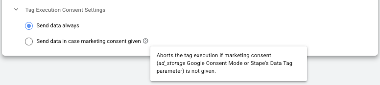
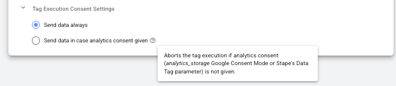

# GTMS-2
## Server Templates Consent Management

### Problem that solved by this standard

Server GTM does not have a built-in consent management system.
Most of the SGTM templates require `ad_storage` consent. A few others can benefit from `analytics_storage` consent.
This standard provides a way to manage consent in the SGTM templates.

### Standard description

- Each template must have a `consentSettingsGroup` parameter.
- `consentGroup` must contain a `adStorageConsent` or `analyticsStorageConsent` parameter.
- For `adStorageConsent` or `analyticsStorageConsent`:
  - must have a `RADIO` UI field type.
  - must have these values `optional`, `required`.
  - must be `optional` by default.
  - If `required`, the template must check if the consent is given and send data only if the consent is given.
  - If `optional`, the template must send data always.
- The template must check if the consent is given by checking the `consent_state` or `x-ga-gcs` Event Data properties.

### Example Code

#### `adStorageConsent`

 ```js
const eventData = getAllEventData();

if (!isConsentGivenOrNotRequired(data, eventData)) {
  return data.gtmOnSuccess();
}

// ...

function isConsentGivenOrNotRequired(data, eventData) {
  if (data.adStorageConsent !== 'required') return true;
  if (eventData.consent_state) return !!eventData.consent_state.ad_storage;
  const xGaGcs = eventData['x-ga-gcs'] || ''; // x-ga-gcs is a string like "G110"
  return xGaGcs[2] === '1';
}
```

#### `analyticsStorageConsent`

```js
const eventData = getAllEventData();

if (!isConsentGivenOrNotRequired(data, eventData)) {
  return data.gtmOnSuccess();
}

// ...

function isConsentGivenOrNotRequired(data, eventData) {
  if (data.analyticsStorageConsent !== 'required') return true;
  if (eventData.consent_state) return !!eventData.consent_state.analytics_storage;
  const xGaGcs = eventData['x-ga-gcs'] || ''; // x-ga-gcs is a string like "G110"
  return xGaGcs[3] === '1';
}
```

### Example UI

#### `adStorageConsent`



```json
{
  "type": "GROUP",
  "name": "tagExecutionConsentSettingsGroup",
  "displayName": "Tag Execution Consent Settings",
  "groupStyle": "ZIPPY_CLOSED",
  "subParams": [
    {
      "type": "RADIO",
      "name": "adStorageConsent",
      "displayName": "",
      "radioItems": [
        {
          "value": "optional",
          "displayValue": "Send data always"
        },
        {
          "value": "required",
          "displayValue": "Send data in case marketing consent given",
          "help": "Aborts the tag execution if marketing consent (<i>ad_storage</i> Google Consent Mode or Stape's Data Tag parameter) is not given."
        }
      ],
      "simpleValueType": true,
      "defaultValue": "optional"
    }
  ]
}
```

#### `analyticsStorageConsent`



```json
{
  "type": "GROUP",
  "name": "tagExecutionConsentSettingsGroup",
  "displayName": "Tag Execution Consent Settings",
  "groupStyle": "ZIPPY_CLOSED",
  "subParams": [
    {
      "type": "RADIO",
      "name": "analyticsStorageConsent",
      "displayName": "",
      "radioItems": [
        {
          "value": "optional",
          "displayValue": "Send data always"
        },
        {
          "value": "required",
          "displayValue": "Send data in case analytics consent given",
          "help": "Aborts the tag execution if analytics consent (<i>analytics_storage</i> Google Consent Mode or Stape's Data Tag parameter) is not given."
        }
      ],
      "simpleValueType": true,
      "defaultValue": "optional"
    }
  ]
}
```
