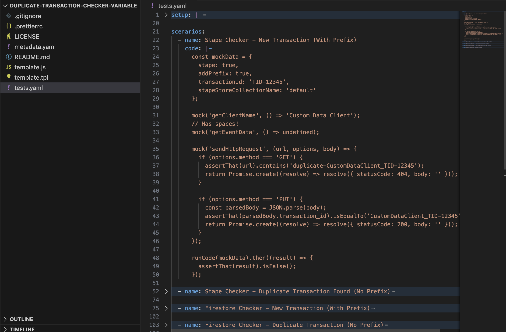
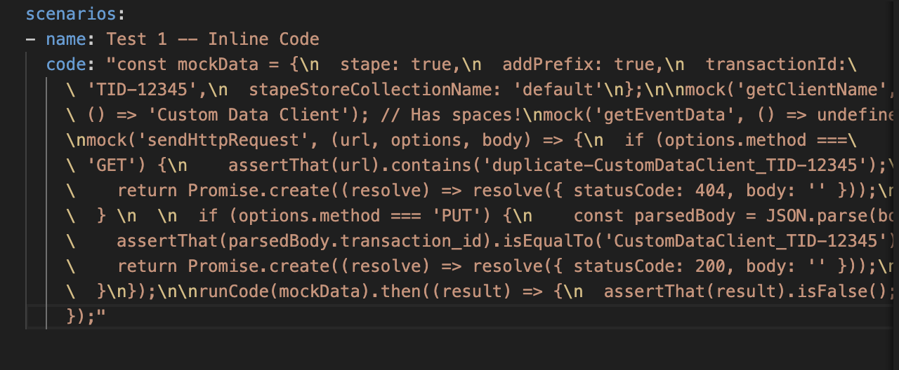

# GTMS-5

## Template repository file structure

### Problem that solved by this standard

There are no standards for the structure of the repository.
Because of this, the repository's structure is different for each project.

There is no requirement to store the code of a template in a separate file, however, it is hard to read the code of the template if it is not extracted to a separate file.

### Standard description

Required by GTM Template Gallery:

- LICENSE
- metadata.yaml
- template.tpl

Required by this standard:

- template.js - Template code
- .prettierrc - Prettier repo-level configuration
- tests.yaml - Tests used in the template
- README.md - Template description

### Tests File

The tests inside `template.tpl` are written in .yaml syntax. Given that, the file `tests.yaml` must be a copy of what is in the `template.tpl` under `__TESTS__`.
Observation: When exporting a template, the tests codes are formatted by GTM into an inline compact hard way to read. Before pushing the `tests.yaml` file, make sure the tests codes are formatted properly using yaml code block sintax (`|-`). See illustration below:

**Correct Format**

**Wrong Format**

