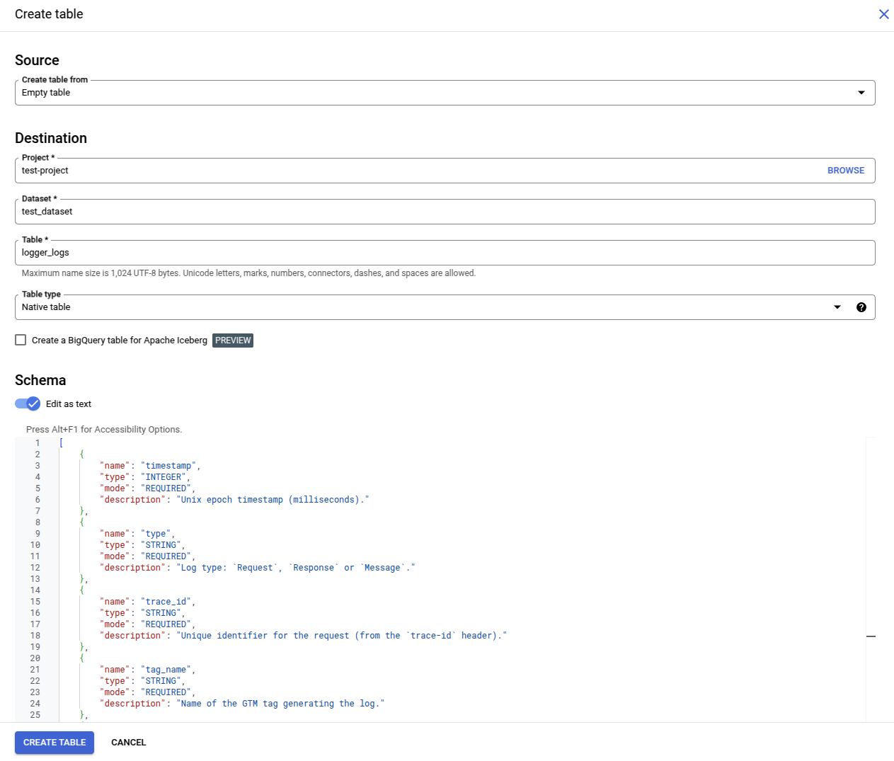

# GTMS-7
## Server Templates BigQuery Logging

### Problem that is solved by this standard

GTM Server-Side does not have a common format for writing logs to `BigQuery`. This standard ensures structured logging, enabling easier querying, debugging, and monitoring.

### Standard description

- Each log line is a row in the BigQuery table.
- Each insertion to the BigQuery table must add only one row at a time.
- Each log line must contain at least: `timestamp`, `type`, `tag_name` and `trace_id` fields.
- Field `timestamp` must contain the Unix epoch timestamp in milliseconds.
- Field `type` must contain one of these values `Request`, `Response`, `Message`. Which helps easily filter logs.
- `trace_id` must contain a unique identifier of the current incoming request. This field is used for stitching all logs done by all tags/clients during one request. It's highly recommended using the `trace-id` header for this, as many clouds/platforms use it for tracing.
- Field `tag_name` must contain the tag name.
- All fields must use snake case naming, e.g. `trace_id`, `response_code`etc. and *not* `TraceId`, `ResponseCode` etc.
- `ignoreUnknownValues` must be set to `true` in `BigQuery.insert(...)` to handle schema changes gracefully. This allows new fields to be added without breaking existing logs.

#### Recommended additional fields
Based on the log `type`, the following additional fields are recommended:

##### For type `Request`

- `request_method`: HTTP method (GET, POST, etc.).
- `request_url`: Full URL of the request.
- `request_body`: JSON string representation of the request body.
- `event_name`: Name of the event being tracked.

##### For type `Response`

- `response_status_code`: HTTP status code.
- `response_body`: JSON string representation of the response body.
- `response_headers`: JSON string representation of response headers.
- `event_name`: Name of the event being tracked.

##### For type `Message`

- `message`: Information or error message.
- `reason`: Explanation of why the message was logged.
- `event_name`: Name of the event being tracked.

---

### BigQuery table

#### Required table schema
| Field Name       | Type     | Mode     | Description |
|-----------------|-----------|----------|-------------|
| `timestamp`     | INTEGER   | REQUIRED | Unix epoch timestamp (milliseconds). |
| `type`          | STRING   | REQUIRED | Log type: `Request`, `Response` or `Message`. |
| `trace_id`      | STRING   | REQUIRED | Unique identifier for the request (from the `trace-id` header). |
| `tag_name`      | STRING   | REQUIRED | Name of the GTM tag generating the log. |

```json
[
    {
        "name": "timestamp",
        "type": "INTEGER",
        "mode": "REQUIRED",
        "description": "Unix epoch timestamp (milliseconds)."
    },
    {
        "name": "type",
        "type": "STRING",
        "mode": "REQUIRED",
        "description": "Log type: `Request`, `Response` or `Message`."
    },
    {
        "name": "trace_id",
        "type": "STRING",
        "mode": "REQUIRED",
        "description": "Unique identifier for the request (from the `trace-id` header)."
    },
    {
        "name": "tag_name",
        "type": "STRING",
        "mode": "REQUIRED",
        "description": "Name of the GTM tag generating the log."
    }
]
```

#### Expanded table schema (suggestion)

| Field Name       | Type     | Mode     | Description |
|-----------------|-----------|----------|-------------|
| `timestamp`     | INTEGER    | REQUIRED | Unix epoch timestamp (milliseconds). |
| `type`          | STRING   | REQUIRED | Log type: `Request`, `Response` or `Message`. |
| `trace_id`      | STRING   | REQUIRED | Unique identifier for the request (from the `trace-id` header). |
| `tag_name`      | STRING   | REQUIRED | Name of the GTM tag generating the log. |
| `request_method`   | STRING   | NULLABLE | HTTP method (GET, POST, etc.) (if applicable). |
| `request_url`   | STRING   | NULLABLE |  URL of the API request (if applicable). |
| `request_body`  | JSON   | NULLABLE |  JSON string representation of request body (if applicable). |
| `response_status_code` | INTEGER    | NULLABLE |  HTTP status code from API response (if applicable). |
| `response_body` | JSON   | NULLABLE |  JSON string representation of API response body (if applicable). |
| `response_headers` | JSON   | NULLABLE |  JSON string representation of API response headers (if applicable). |
| `event_name`       | STRING   | NULLABLE |  Name of the event being tracked. |
| `message`       | STRING   | NULLABLE |  Additional log messages (for `Message` type). |
| `reason`        | STRING   | NULLABLE |  Reason for failure (for `Message` type). |

```json
[
    {
        "name": "timestamp",
        "type": "INTEGER",
        "mode": "REQUIRED",
        "description": "Unix epoch timestamp (milliseconds)."
    },
    {
        "name": "type",
        "type": "STRING",
        "mode": "REQUIRED",
        "description": "Log type: `Request`, `Response` or `Message`."
    },
    {
        "name": "trace_id",
        "type": "STRING",
        "mode": "REQUIRED",
        "description": "Unique identifier for the request (from the `trace-id` header)."
    },
    {
        "name": "tag_name",
        "type": "STRING",
        "mode": "REQUIRED",
        "description": "Name of the GTM tag generating the log."
    },
    {
        "name": "request_method",
        "type": "STRING",
        "mode": "NULLABLE",
        "description": "HTTP method (GET, POST, etc.)."
    },
    {
        "name": "request_url",
        "type": "STRING",
        "mode": "NULLABLE",
        "description": "URL of the API request."
    },
    {
        "name": "request_body",
        "type": "JSON",
        "mode": "NULLABLE",
        "description": "JSON string representation of request body."
    },
    {
        "name": "response_status_code",
        "type": "INTEGER",
        "mode": "NULLABLE",
        "description": "HTTP status code from API response."
    },
    {
        "name": "response_body",
        "type": "JSON",
        "mode": "NULLABLE",
        "description": "JSON string representation of API response body."
    },
    {
        "name": "response_headers",
        "type": "JSON",
        "mode": "NULLABLE",
        "description": "JSON string representation of API response headers."
    },
    {
        "name": "event_name",
        "type": "STRING",
        "mode": "NULLABLE",
        "description": "Name of the event being tracked."
    },
    {
        "name": "message",
        "type": "STRING",
        "mode": "NULLABLE",
        "description": "Additional log messages (for `Message` type)."
    },
    {
        "name": "reason",
        "type": "STRING",
        "mode": "NULLABLE",
        "description": "Reason for failure (for `Message` type)."
    }
]
```

#### Creating the BigQuery Table

It's possible to create the table using the UI or via SQL.

Before creating the table you can choose a **partitioning setting** and also a **clustering setting**. It's not required, but this can help optimize performance and costs associated with this table.
Suggestion: **partition** by `ingestion time - day` and **cluster** by `tag_name` or `type`.

- Method 1: Using the BigQuery UI

Go to **BigQuery project**; choose or create a **dataset**; for the chosen dataset click the three vertical dots next to its name and select **"Create table"**.

Give the table a name and click `Edit as text` under the _Schema_ section.
Copy and paste the [required table schema](#required-table-schema) or the [expanded table schema](#expanded-table-schema-suggestion).



Optionally, you can define the **partitioning setting** and **clustering setting**.


- Method 2: Using SQL

Go to **BigQuery project**; choose or create a **dataset**; open a **new query** and run the following command.
Optionally, you can define the **partitioning setting** and **clustering setting**.
```sql
CREATE TABLE `<your_project_id>.<your_dataset_id>.<your_table_id>` (
  -- Required fields
  timestamp INTEGER NOT NULL OPTIONS(description="Unix epoch timestamp (milliseconds)."),
  type STRING NOT NULL OPTIONS(description="Log type: `Request`, `Response` or `Message`."),
  trace_id STRING NOT NULL OPTIONS(description="Unique identifier for the request (from the `trace-id` header)."),
  tag_name STRING NOT NULL OPTIONS(description="Name of the GTM tag generating the log."),
  -- Optional fields
  request_method STRING OPTIONS(description="HTTP method (GET, POST, etc.)."),
  request_url STRING OPTIONS(description="URL of the API request."),
  request_body JSON OPTIONS(description="JSON string representation of request body."),
  response_status_code INTEGER OPTIONS(description="HTTP status code from API response."),
  response_body JSON OPTIONS(description="JSON string representation of API response body."),
  response_headers JSON OPTIONS(description="JSON string representation of API response headers."),
  event_name STRING OPTIONS(description="Name of the event being tracked."),
  message STRING OPTIONS(description="Additional log messages (for `Message` type)."),
  reason STRING OPTIONS(description="Reason for failure (for `Message` type).")
)
-- Optional
PARTITION BY _PARTITIONDATE -- Partition by day
CLUSTER BY tag_name; -- Cluster by tag_name or type
```

---

### Example Code

```js
const BigQuery = require('BigQuery');
const getRequestHeader = require('getRequestHeader');
const getTimestampMillis = require('getTimestampMillis');
const JSON = require('JSON');
const isLoggingEnabledForBigQuery = determinateIsLoggingEnabledForBigQuery();
const traceId = isLoggingEnabled ? getRequestHeader('trace-id') : undefined;

const postUrl = 'https://example.com';
const postBody = { 'data': 'some data' };

// 'Message'
if (validateMissingRequiredFields()) {
  logToBigQuery({
    'tag_name': 'Example',
    'type': 'Message',
    'trace_id': traceId,
    'timestamp': getTimestampMillis(),
    'event_name': 'purchase',
    'message': 'Request won\'t be sent.',
    'reason': 'One or more fields are missing: Email, Phone Number or External ID.'
  });
  return data.gtmOnFailure();
}

// 'Request'
logToBigQuery({
  'tag_name': 'Example',
  'type': 'Request',
  'trace_id': traceId,
  'timestamp': getTimestampMillis(),
  'event_name': 'purchase',
  'request_method': 'POST',
  'request_url': postUrl,
  'request_body': JSON.stringify(postBody)
});

// 'Response'
sendHttpRequest(postUrl, (statusCode, headers, body) => {
  logToBigQuery({
    'tag_name': 'Example',
    'type': 'Response',
    'trace_id': traceId,
    'timestamp': getTimestampMillis(),
    'event_name': 'purchase',
    'response_status_code': statusCode,
    'response_headers': JSON.stringify(headers),
    'response_body': JSON.stringify(body)
  });
}, { method: 'POST' }, JSON.stringify(postBody));

function logToBigQuery(logObject) {
  if (isLoggingEnabledForBigQuery) {
    const connectionInfo = {
      projectId: data.logBigQueryProjectId,
      datasetId: data.logBigQueryDatasetId,
      tableId: data.logBigQueryTableId
    };
    BigQuery.insert(connectionInfo, [logObject], { ignoreUnknownValues: true });
  }
}

function determinateIsLoggingEnabledForBigQuery() {
  if (data.bigQueryLogType === 'no') return false;
  return data.bigQueryLogType === 'always';
}
```

### Example UI


```json
{
  "displayName": "BigQuery Logs Settings",
  "name": "bigQueryLogsGroup",
  "groupStyle": "ZIPPY_CLOSED",
  "type": "GROUP",
  "subParams": [
    {
      "type": "RADIO",
      "name": "bigQueryLogType",
      "radioItems": [
        {
          "value": "no",
          "displayValue": "Do not log to BigQuery"
        },
        {
          "value": "always",
          "displayValue": "Log to BigQuery"
        }
      ],
      "simpleValueType": true,
      "defaultValue": "no"
    },
    {
      "type": "GROUP",
      "name": "logsBigQueryConfigGroup",
      "groupStyle": "NO_ZIPPY",
      "subParams": [
        {
          "type": "TEXT",
          "name": "logBigQueryProjectId",
          "displayName": "BigQuery Project ID",
          "simpleValueType": true,
          "help": "Optional.  <br><br>  If omitted, it will be retrieved from the environment variable <I>GOOGLE_CLOUD_PROJECT</i> where the server container is running. If the server container is running on Google Cloud, <I>GOOGLE_CLOUD_PROJECT</i> will already be set to the Google Cloud project's ID."
        },
        {
          "type": "TEXT",
          "name": "logBigQueryDatasetId",
          "displayName": "BigQuery Dataset ID",
          "simpleValueType": true,
          "valueValidators": [
            {
              "type": "NON_EMPTY"
            }
          ]
        },
        {
          "type": "TEXT",
          "name": "logBigQueryTableId",
          "displayName": "BigQuery Table ID",
          "simpleValueType": true,
          "valueValidators": [
            {
              "type": "NON_EMPTY"
            }
          ]
        }
      ],
      "enablingConditions": [
        {
          "paramName": "bigQueryLogType",
          "paramValue": "always",
          "type": "EQUALS"
        }
      ]
    }
  ]
}
```
