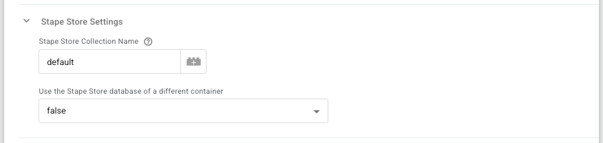

# GTMS-8
## Server Templates Stape Store Integration

### Problem that solved by this standard

This standard provides a way to standardize Stape Store configurations (Collection Name and writing to a different container Store) across templates that use Stape Store.

### Standard description

- When using Stape Store, the template must have a `stapeStoreSettingsGroup` group parameter.
  - The `stapeStoreSettingsGroup` must contain:
    - `stapeStoreCollectionName` text parameter with default value `default` (the default value can be changed if needed) and also a validation of not empty value.
      - In the `getStapeStoreBaseUrl()` function, add a fallback to the same default value. In this case, `default` but it can be changed if needed.
    - `useDifferentStapeStore` drop-down parameter with values `true` and `false` and default value `false`.
      - `stapeStoreContainerApiKey` text parameter that is only visible when `useDifferentStapeStore` is not `false`. It must have a validation of not empty value.
- In the code:
  - the `getStapeStoreBaseUrl()` function must be used to get the Stape Store base URL.
  - the `getStapeStoreDocumentUrl()` function must be used to get the Stape Store document URL.
  - the `generateDocumentId()` function must be used to generate a document ID. This function can be modified if needed.

### Example Code

```js
// ...

function generateDocumentId() {
  const rnd = makeString(generateRandom(1000000000, 2147483647));
  return 'store_' + makeString(getTimestampMillis()) + rnd; /* The document name prefix can be modified if needed. */
}

function getStapeStoreDocumentUrl(data, documentId) {
  const storeBaseUrl = getStapeStoreBaseUrl(data);
  return storeBaseUrl + '/' + enc(documentId);
}

function getStapeStoreBaseUrl(data) {
  let containerIdentifier;
  let defaultDomain;
  let containerApiKey;
  const collectionPath =
    'collections/'
    + enc(data.stapeStoreCollectionName || 'default' /* The collection name can be modified if needed. */)
    + '/documents';

  const shouldUseDifferentStore =
    isUIFieldTrue(data.useDifferentStapeStore) &&
    getType(data.stapeStoreContainerApiKey) === 'string';
  if (shouldUseDifferentStore) {
    const containerApiKeyParts = data.stapeStoreContainerApiKey.split(':');
    const containerLocation = containerApiKeyParts[0];
    const containerRegion = containerApiKeyParts[3] || 'io';
    containerIdentifier = containerApiKeyParts[1];
    defaultDomain = containerLocation + '.stape.' + containerRegion;
    containerApiKey = containerApiKeyParts[2];
  } else {
    containerIdentifier = getRequestHeader('x-gtm-identifier');
    defaultDomain = getRequestHeader('x-gtm-default-domain');
    containerApiKey = getRequestHeader('x-gtm-api-key');
  }

  return (
    'https://' +
    enc(containerIdentifier) +
    '.' +
    enc(defaultDomain) +
    '/stape-api/' +
    enc(containerApiKey) +
    '/v2/store/' +
    collectionPath
  );
}

// An example of the final call to the Store. It can be modified as needed.
function logToStapeStore(data, dataToLog) {
  const documentId = generateDocumentId();
  const documentUrl = getStapeStoreDocumentUrl(data, documentId);
  const requestMethod = 'PUT';

  sendHttpRequest(
    documentUrl,
    { method: requestMethod, headers: { 'Content-Type': 'application/json' } },
    JSON.stringify(dataToLog)
  )
    .then((response) => {
      if (!data.useOptimisticScenario) {
        if (response.statusCode === 200) return data.gtmOnSuccess();
        return data.gtmOnFailure();
      }
    })
    .catch(() => {
      if (!data.useOptimisticScenario) return data.gtmOnFailure();
    });
}

// ...
```

### Example UI



```json
{
  "type": "GROUP",
  "name": "stapeStoreSettingsGroup",
  "displayName": "Stape Store Settings",
  "groupStyle": "ZIPPY_OPEN_ON_PARAM",
  "subParams": [
    {
      "type": "TEXT",
      "name": "stapeStoreCollectionName",
      "displayName": "Stape Store Collection Name",
      "simpleValueType": true,
      "help": "The name of the collection on the Stape Store that contains (or will contain) the document with the data.\n<br/><br/>\nIf not set, the <i>default</i> Collection Name will be used.",
      "defaultValue": "default"
    },
    {
      "type": "SELECT",
      "name": "useDifferentStapeStore",
      "displayName": "Use the Stape Store database of a different container",
      "macrosInSelect": true,
      "selectItems": [
        {
          "value": true,
          "displayValue": "true"
        },
        {
          "value": false,
          "displayValue": "false"
        }
      ],
      "simpleValueType": true,
      "subParams": [
        {
          "type": "TEXT",
          "name": "stapeStoreContainerApiKey",
          "displayName": "Stape Store Container API Key",
          "simpleValueType": true,
          "valueHint": "euk:kzlfoobar:55ec021d429be49e64e691429cf0f27440a1b789kzlfoobar",
          "help": "If you want to interact with the Stape Store of a different container hosted on Stape, specify the <b>Container API Key</b> of this container.\n<br/><br/>\nTo find the <b>Container API Key</b>, go to the <a href=\"https://app.eu.stape.dev/container\">Stape Admin panel</a>, select the sGTM container which the Stape Store you want to interact with, go to the <i>Settings</i> tab and scroll down to the <i>Container settings</i> section.",
          "enablingConditions": [
            {
              "paramName": "useDifferentStapeStore",
              "paramValue": false,
              "type": "NOT_EQUALS"
            }
          ],
          "valueValidators": [
            {
              "type": "NON_EMPTY"
            }
          ]
        }
      ],
      "defaultValue": false
    }
  ]
}
```